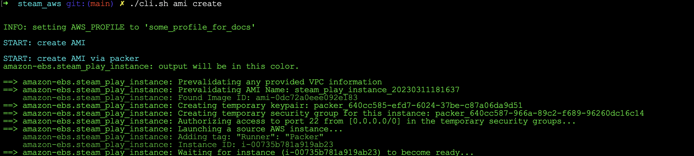
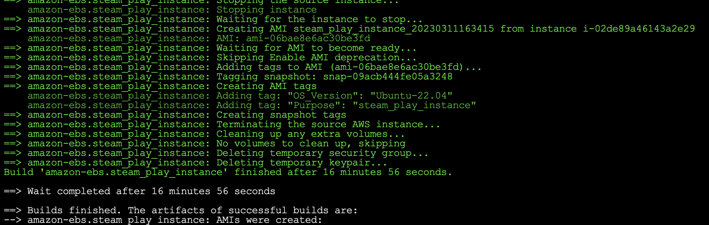
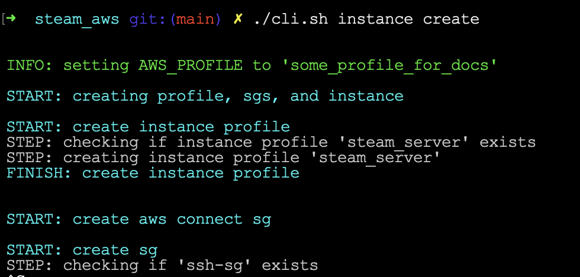
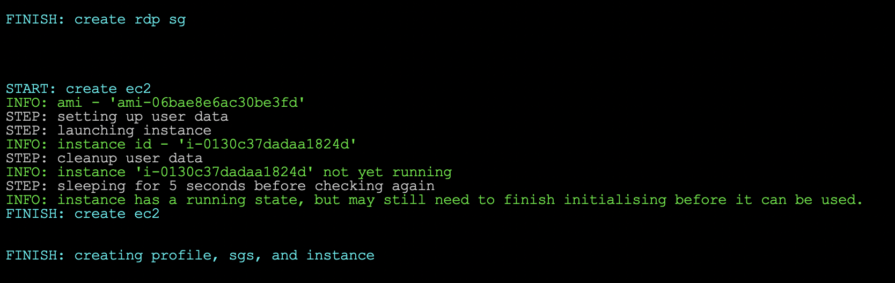
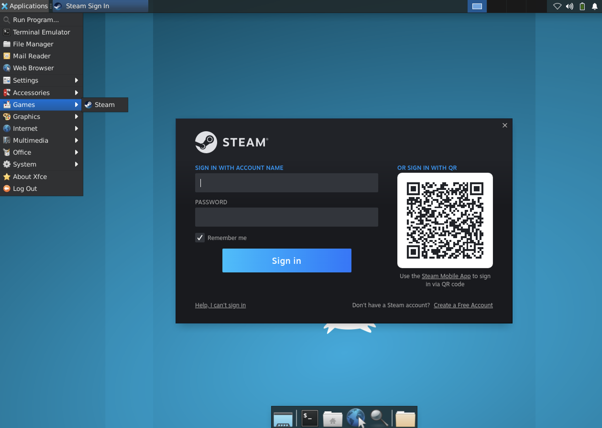
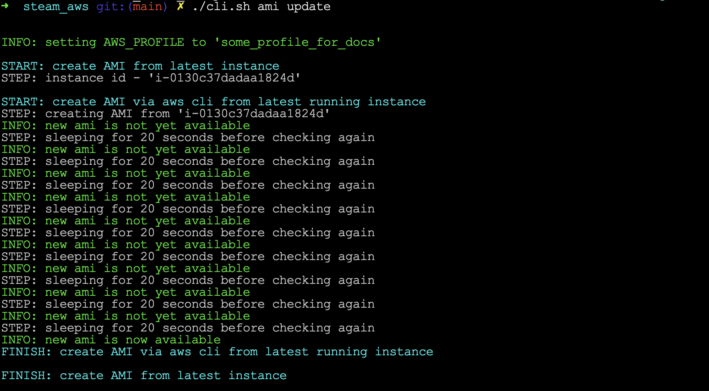

# **STEAM AWS CLI**


## *Description*

This repo contains a cli for controlling the basic lifecycle of a linux ec2 instance with Steam installed and remote desktop protocol (rdp) access.

It can handle the creation, deletion, pruning, and updating of amis, ec2 instances, security-groups (sgs), and instance profiles.

It uses the ip addresses the user would have entered into the config to ensure that only aws can ssh onto the instance, and only your chosen ip address can remote desktop onto the instance.

There is funcitonality to also retrict the outbound access to your chosen ip addresses
but it is currently commented out as it would require finding out what ports/ranges Steam requires to function.


<br/>

## *Purpose*

<br/>

This repo was mostly to give a hand at setting up a steam installation in the cloud as a fun side-project, and also to get some more practise at writing out a bash based utility.

Not actually recommended to use given the costs of running any instances that would actually be able to handle most modern games!

See also: [Final Thoughts](#final-thoughts) section of this README

<br/>
<br/>

---------

<br/>
<br/>

## **HOW TO USE IT**

<br/>

The order of commands does matter whether it be spinning up or spinning down, but in particular when spinning down (i.e. removing resources). Dependencies come to really matter at that point.

Keep that in mind if you see any errors, and refer back to this guide for the recommended usage!

<br/>

***Sections:***
* [Pre-run requirements](#requirements)
* [Config setup](#config)
* [Help sub-command](#help)
* [First run](#first-run)
    * [Creating AMI and instance](#creating-ami-and-instance)
    * [Remote desktop access](#remote-desktop-access)
* [Saving changes to instance](#saving-changes-to-instance)
* [Cleaning up resources](#cleaning-up-resources)

<br/>

### **Requirements**

<br/>

* have some kind of remote desktop software installed, e.g. 'Microsoft Remote Desktop'
* have an aws account
* have awscli installed if running in terminal
    * and have an aws profile ready in your ~/.aws/config
* have jq installed if running in terminal
* setup the secrets file and any other config you wish to modify.
    * See [config section](#config) for details.


<br/>

### **Config**

<br/>

There are config files under the [config folder](cli/config), generally you would only want to change the values for the secrets.sh - to do so you'll first have to create it!

Look at the [secrets.sh.example](cli/config/secrets.sh.example) file for details.

You may also want to change some values in the [user specific config](cli/config/user_specific_config.sh) file - in particular the default instance type would not run most modern games very well.

> NOTE: if you do wish to change values in the [general config file](cli/config/general_config.sh) it would be best to ensure you've terminated any instances/sgs etc as certain values there are used to find instances and other resources so that the cli can confirm existence or even delete.

<br/>

### **Help**

<br/>

You can use the help sub-command to see a guide to the cli, as well as a guide to the other sub-commands.

This should cover the basic questions, but in the rest of this README there are tips for what to run when you're using this for the first time and also how to clean up all created resources as well as a few other tips.

<br/>

> ***NOTE: run all commands from the root of this repo!***

<br/>

```bash
./cli.sh help
```

<br/>

### **First Run**

<br/>

#### **Creating AMI and Instance**

<br/>

Order of dependencies: ami -> profile -> sgs -> instance

When running for first time you'll need to create the ami, and then you can launch an instance

> NOTE: launching an instance will also create the instance profile and relevant sgs if they haven't been created already

run the following commands at root of rep once you have created and filled in the secrets file. See [the example secrets file](cli/config/secrets.sh.example) for details.

<br/>

```bash
./cli.sh ami create
```





<br/>

```bash
./cli.sh instance create
```





<br/>

At this point it'll take a few minutes for the instance to startup and run through any startup scripts, see section on [startup scripts](#startup-scripts) to learn more.

See section on [remote desktop access](#remote-desktop-access) for details on how to connect and use the instance.

<br/>

#### **Remote Desktop Access**

<br/>

Once the instance is up and running you can open up your remote desktop software and create a connection to your new instance. 

You can find your instance ip address from the aws web console, and the user name and password will match the values for login and password that are used in the [user specific config file](cli/config/user_specific_config.sh#L28), with the password being sourced originally from the [secrets file](cli/config/secrets.sh.example#L29).

<br/>

> NOTE: one of the [startup scripts](packer/scripts/startup/01_account.sh) is responsible for creating the password for the user account at startup, that may take a minute to run so you might need to wait a little post instance initialisation before you can connect via RDP

<br/>

Once you're connected you can find steam under applications in the top left (if using ubuntu 22.04), and then under games.

The first time you run it it'll likely need to update, but then you can login and download/play games!

<br/>



<br/>

> NOTE: one issue that I haven't fixed is that the audio doesn't work! The cost of running this isn't very economical meaning I'm not planning to use this myself, so after looking into some possible fixes for a bit I just left the issue as is! You can see some attempts at a fix at the [audio startup script](packer/scripts/startup/02_audio.sh).

You'll need to do this update for steam, and downloading of games each time you spin up an instance unless you use the ami update command, see section on [saving changes to instance](#saving-changes-to-instance)

<br/>

### **Saving Changes to Instance**

<br/>

After you use the instance for a while you'll probably want to ensure you don't have to keep redownloading games and updating steam, this section will detail how:

> NOTE:  
> Download speeds are actually really fast and steam has cloud saves so perhaps not the biggest concern.  

> Also looking at current date pricing guides it doesn't look like aws currently charges for downloading data onto instances.  

> That may change, or differ per region though so don't take my word on it!

ensure you keep your current instance running that you wish to record the state of, and then run the following:

```bash
./cli.sh ami update
```



this will find the most recently launched instance and create a new ami based off of its current state, this will include the updates to the steam client and any downloaded games data.

Once the new AMI has been made keep in mind that new AMI will be the most recently created AMI and thus any new instances launches will use that AMI.

At this point you can teardown your current instance and your data will be stored ready for the next time you spin up an instance.

Don't forget to prune your old AMI, and any old volume snapshots as well.

You can teardown everything except the most recent AMI (and related snapshot) and you'll be able to keep your updates safe for the next time you deploy an ec2 instance.

If you delete that AMI but still have the volume snapshot then you'll need to tweak the packer file to target that snapshot id in order to have that volume snapshot tied to a new AMI.

If you delete even your most recent volume snapshot then you'll have lost whatever updates you had made to that desktop beyond the base setup from the original first-time AMI.

<br>

### **Cleaning Up Resources**

<br/>

If you wish to clean up all the related aws resouces then you need to go in reverse order to creation due to dependencies between resources.

Although not recommended it is possible to have multiple ec2 instances. It is also possible to have multiple AMIs, and each AMI will have a tied volume snapshot.

To ensure everything is deleted from aws you'll want to first run the relefvant prune commands to ensure any older resources are cleaned up, and then run the relevant delete commands to remove the most recent versions of each resource.

See below:

```bash
./cli.sh instance prune # to delete all but the most recent instances

./cli.sh ami prune # to delete all but the most recent AMIs now that the older instances are deleted

./cli.sh snapshot prune # to delete all but the most recent volume snapshots now that the older AMIs are deleted
```

At this point only the most recent versions of everyting (plus the security groups and instance profile) are remaining

```bash
./cli.sh instance delete # to delete the most recently launched instance

./cli.sh ami delete # to delete all the most recently created AMI

./cli.sh snapshot delete # to delete the most recently created volume snapshot
```
Now everything has been deleted and no resources related to this cli should be in aws, barring aws api issues or config errors where tag values where changed in config while having pre-existing resources.

<br/>
<br/>

-----

<br/>

## Final Thoughts

<br/>
